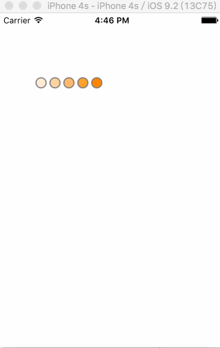

# IndicatorView



##  使用方法

```
RYSpotIndicatorView * spot = [[RYSpotIndicatorView alloc]init];
[spot setFrame:CGRectMake(10, 100,80 ,20)];
spot.circleSize = CGSizeMake(40, 40);
[self.view addSubview:spot];
spot.backgroundColor = [UIColor greenColor];

```